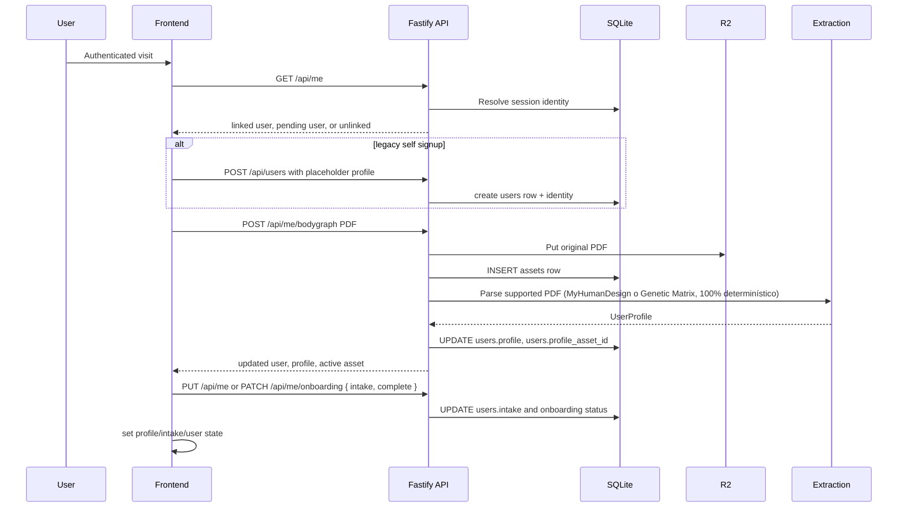
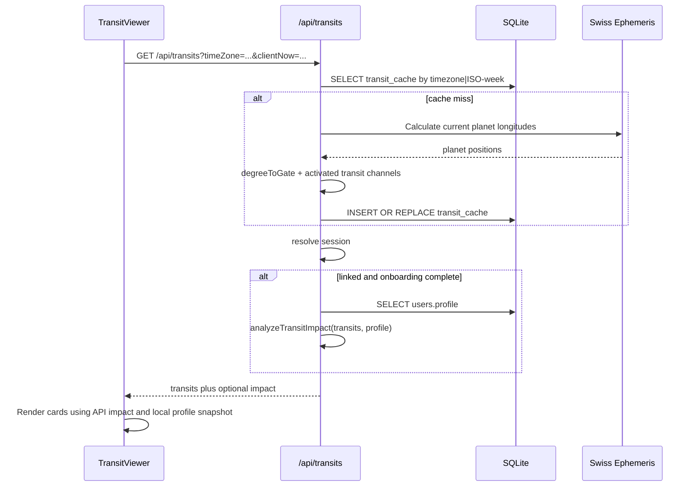
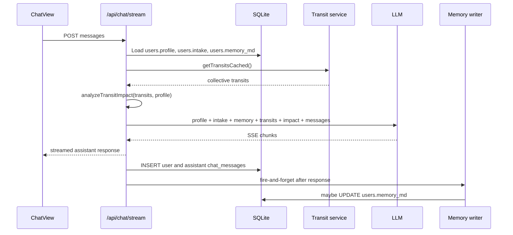
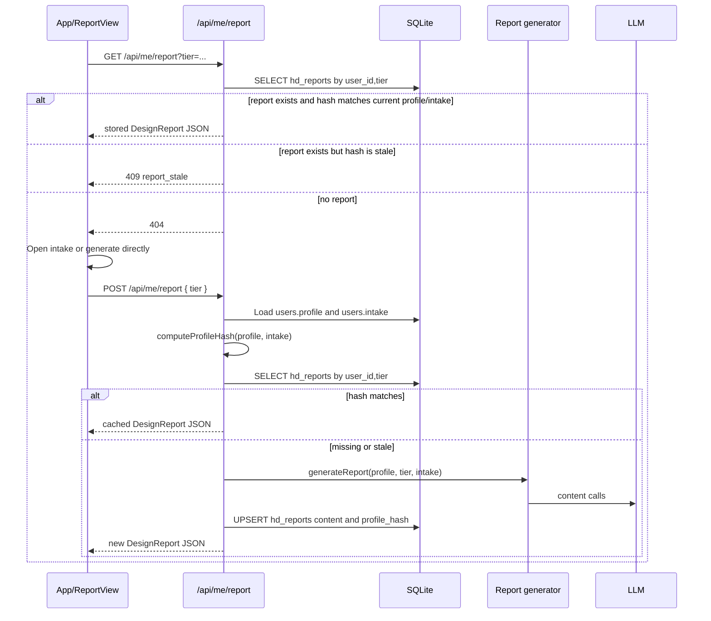
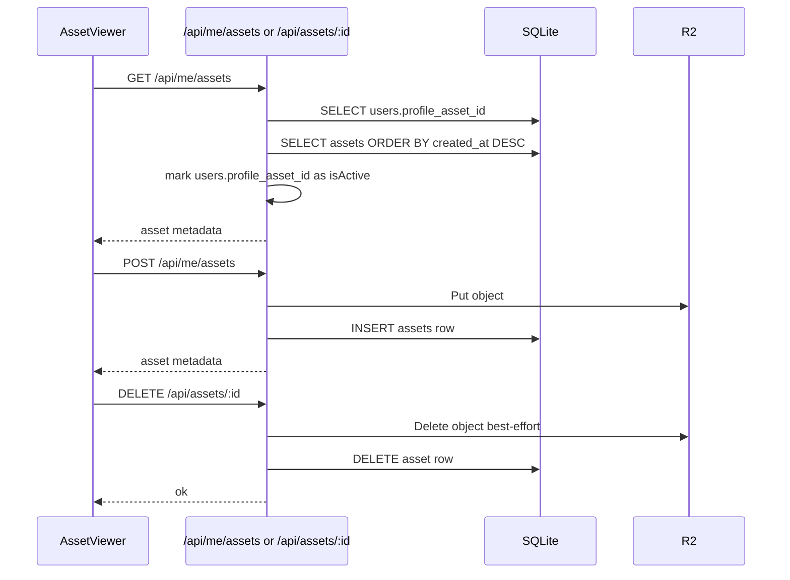

# Astral Architecture Guidelines

Last updated: 2026-05-08.

This file is the canonical architecture map for bodygraph, transits, chat,
reports, assets, and memory. Treat it as code-truth documentation: update it
when one of these flows changes.

## Ground Rules

- The current bodygraph source of truth is `users.profile` in SQLite.
- Asset files are source material, not the active bodygraph state.
- Transit impact is derived at request time from `users.profile`.
- Report content is materialized and can become stale unless its hash is
  checked before serving it.
- Frontend React state is a local snapshot. It must be refreshed or updated
  explicitly after any profile/bodygraph mutation.
- Do not rely on `localStorage("astral_user")` for production identity or
  bodygraph state. Current identity comes from SuperTokens session cookies and
  `/api/me`; old docs/tests may still seed localStorage for legacy mocks.

## Source Of Truth

| Concern | Current source of truth | Cached/materialized copies | Important caveat |
|---|---|---|---|
| User identity | `user_identities` plus SuperTokens session | Frontend `user` state | Query `userId` is not trusted without matching session. |
| Active HD profile/bodygraph data | `users.profile` JSON | Frontend `profile` state, chat prompts, report hash/content | `users.profile_asset_id` records the source asset, but `users.profile` remains the source of truth. |
| Source files | `assets` rows plus R2 objects | `AssetViewer` state | `assets[].isActive` reflects `users.profile_asset_id`; source files do not replace `users.profile` unless the explicit bodygraph replacement endpoint succeeds. |
| Intake/business context | `users.intake` JSON | Frontend `intake` state, report hash/content | Intake changes only affect reports after save/regeneration path. |
| Collective transits | `transit_cache.data` by week/timezone key | In-memory `cachedTransits` in `transit-service.ts` | Cache stores collective planet data only, not personalized impact. |
| Personalized transit impact | Computed by `analyzeTransitImpact(transits, users.profile)` | API response only | Recomputed per request if session user is linked and onboarding complete. |
| Chat history | `chat_messages` | Frontend `messages` state | Full visible chat history is sent back to the LLM on each user message. |
| Long-term memory | `users.memory_md` | Prompt `<user_memory>` | Can contain facts learned under an old bodygraph unless invalidated or rewritten. |
| Reports | `hd_reports.content` plus `profile_hash` | Frontend `report` state, shared/PDF output | Reads block stale materialized content with `409 report_stale`; regeneration still happens only through `POST /report`. |

## Data Model

Relevant tables live in `backend/src/db.ts`.

```text
users
  id, name, email
  profile          -- JSON UserProfile; canonical HD bodygraph data
  profile_asset_id -- nullable asset id that produced the active bodygraph
  intake           -- JSON Intake
  memory_md        -- Living Document memory
  plan, role, status
  onboarding_status, onboarding_step, access_source
  created_at, updated_at

assets
  id, user_id, filename, mime_type, file_type, size_bytes, storage_key
  created_at, updated_at

transit_cache
  week_key         -- ISO week or timezone|ISO-week
  data             -- WeeklyTransits JSON
  created_at

hd_reports
  id, user_id, tier
  profile_hash     -- hash(profile.humanDesign + intake)
  content          -- materialized DesignReport JSON
  tokens_used, cost_usd
  created_at, updated_at

chat_messages
  id, user_id, role, content, feedback_*, created_at
```

`users.profile_asset_id` is the persisted relation from the active bodygraph to
the source PDF asset that produced it. If the asset is deleted, the profile
remains canonical and the relation is cleared.

## Onboarding And Bodygraph Extraction



Notes:

- Extraction only changes the application when the resulting profile is saved
  into `users.profile` through the explicit bodygraph replacement flow.
- Uploading a generic asset by itself does not change `users.profile`.
- Deleting a file by itself does not change `users.profile`.

## Transit Flow



Current behavior:

- The collective transit payload is cached per week and timezone.
- Personalized impact is not cached in `transit_cache`; it is recalculated from
  the current persisted `users.profile` on each request.
- `TransitViewer` also uses local `profile` state to decide whether a planet
  card "touches" a user gate. If frontend profile state is stale, the card
  highlight can disagree with backend `impact`.
- Chat calls `getTransitsCached()` without client timezone/clientNow today, so
  chat transit context follows server-side `new Date()` and default timezone
  behavior.

Important naming caveat: the current "weekly" transit service calculates planet
positions for a single `now`, then caches that instantaneous result for the
week. It is not a sampled seven-day ephemeris.

## Chat Flow



Current behavior:

- Backend chat reads `users.profile` fresh from DB each request.
- Frontend sends the visible conversation history, so old assistant/user
  messages can remain in prompt context after a bodygraph correction.
- `users.memory_md` can also preserve facts extracted from conversations that
  happened under an incorrect bodygraph.

## Report Flow



Current behavior:

- `POST /api/me/report` is hash-aware and regenerates when
  `profile.humanDesign` or `intake` changes.
- `GET /api/me/report`, legacy report reads, report PDF, report share, and
  shared report routes compare stored `profile_hash` with the current
  profile/intake hash before serving materialized content.
- `frontend/src/App.tsx` treats `409 report_stale` as a signal to clear local
  report state and regenerate only through `POST /api/me/report` when required
  intake fields are already present.

## Asset Flow



Current behavior:

- `AssetViewer` uses `POST /api/me/bodygraph` to upload an official HD PDF,
  extract a profile, and replace `users.profile` in one product operation.
- Generic asset upload still does not run extraction or update `users.profile`.
- `assets[].isActive` means `asset.id === users.profile_asset_id`.
- Deleting the active asset clears `users.profile_asset_id`, but leaves profile,
  reports, chat history, and memory unchanged.

## Bodygraph Change Invariant

A correct "replace bodygraph" flow must be transactional at the product level.
When the active bodygraph changes, all dependent surfaces must become coherent
with the same new profile.

Minimum expected effects:

1. Upload new HD PDF through `POST /api/me/bodygraph`.
2. Extract a new `UserProfile` from that asset.
3. Persist the new profile into `users.profile` and link `users.profile_asset_id`.
4. Update frontend `profile` state immediately.
5. Clear frontend `report` state or force a hash-aware report load.
6. Ensure report GET/PDF/share paths cannot serve stale content silently.
7. Decide what to do with `users.memory_md` and old `chat_messages`.

Implemented structural fix:

- `users.profile_asset_id` links the active profile to the asset that produced
  it.
- Bodygraph replacement is an API operation, not a loose sequence of asset
  upload plus manual profile update.
- Frontend replacement clears materialized report state and refreshes the local
  profile snapshot.

## Current Bug Assessment

The user's suspicion is partially correct but the mechanism is different from a
per-user transit cache.

What is not happening:

- There is no persisted per-user "weekly transit impact" cache.
- `/api/transits` recomputes `impact` from `users.profile` on every request.

What is happening:

- Generic asset library changes can happen without changing `users.profile`.
- Existing reports are blocked with `409 report_stale` when their stored hash no
  longer matches current `users.profile` plus intake.
- Frontend `profile` and `report` state must still be updated explicitly after
  any profile change.
- Chat history and memory can preserve old chart-derived statements.

Therefore, bodygraph replacement must use `POST /api/me/bodygraph`; generic
asset upload/deletion remains source-file management and does not redefine the
canonical bodygraph.

## Daily Transit Direction

The current service should not be renamed blindly. Its ephemeris sample is
already "current instant"; its cache and UX are weekly.

To add "transitos de hoy" safely:

1. Introduce explicit period semantics: `period=day|week`.
2. Add daily cache key by local date and timezone, for example
   `America/Argentina/Buenos_Aires|2026-05-08`.
3. Add response fields that do not overload `weekRange`, for example
   `period`, `dateLabel`, and optionally `rangeLabel`.
4. Pass `timeZone` and `clientNow` into chat transit context, or persist a user
   timezone preference.
5. Keep weekly view as a separate tab only if product wants the current weekly
   label/cache behavior, or redefine weekly as a true seven-day sampled view.
6. Update prompt copy from "esta semana" to "hoy" when daily period is used.

## Files Touched For The Bodygraph/Report Fix

Backend:

- `backend/src/db.ts`: schema and helpers for `profile_asset_id`.
- `backend/src/routes/assets.ts`: `POST /api/me/bodygraph` and active asset
  serialization from `users.profile_asset_id`.
- `backend/src/routes/report.ts`: hash-aware report reads/PDF/share.

Frontend:

- `frontend/src/api.ts`: bodygraph replacement API and `report_stale` error.
- `frontend/src/App.tsx`: update profile/report state after bodygraph changes.
- `frontend/src/components/AssetViewer.tsx`: replace-bodygraph UX instead of
  generic natal upload for all files.
- `frontend/src/components/OnboardingFlow.tsx`: use the replacement endpoint
  for first bodygraph extraction.
- `frontend/src/types.ts`: active asset metadata comment.

Tests:

- `backend/src/__tests__/api-assets.test.ts`: active bodygraph relation and
  deletion/replacement behavior.
- `backend/src/__tests__/api-extract.test.ts`: bodygraph replacement endpoint.
- `backend/src/__tests__/api-transits.test.ts`: bodygraph replacement affects
  impact immediately.
- `backend/src/__tests__/api-report.test.ts`: stale report read path after
  profile change.
- `backend/src/__tests__/api-chat.test.ts`: chat uses latest profile and correct
  daily/weekly transit period.
- `e2e/specs/18-onboarding-and-assets-resilience.spec.ts`: replace wrong
  bodygraph flow.
- `e2e/specs/20-transits-weekly-view.spec.ts`: keep weekly behavior.
- New E2E for daily transits.
